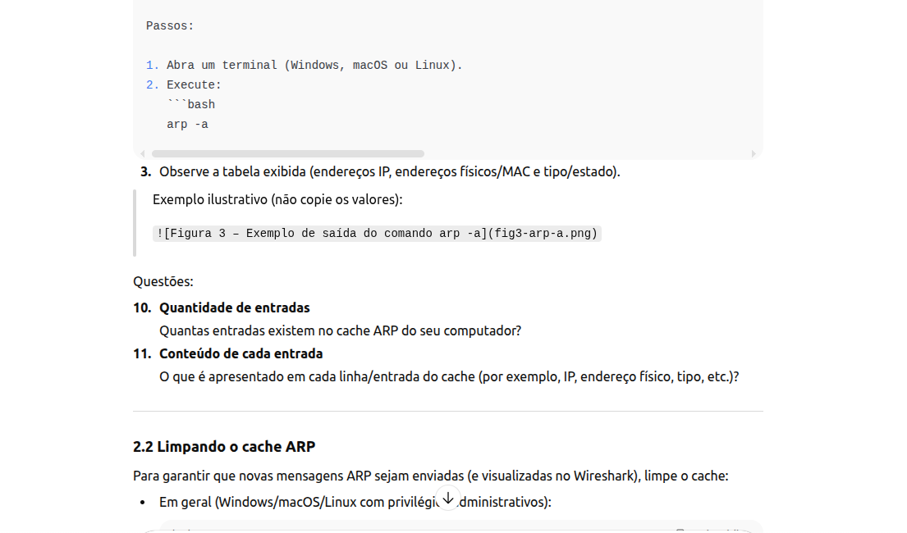
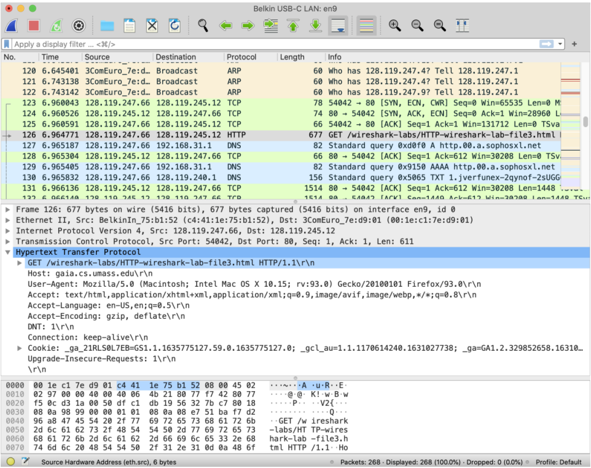
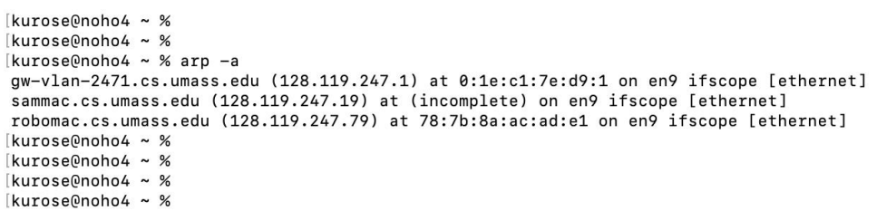
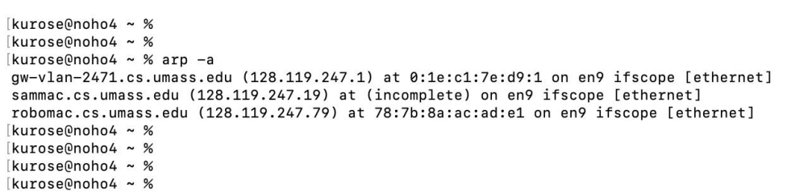

# Universidade Federal de Viçosa (UFV) Campus Rio Paranaíba
## SIN 352 - Redes de Computadores
### Laboratório Wireshark: Ethernet e ARP
### Prof. Dr. Rodrigo Moreira


---

## Objetivos do laboratório

Neste laboratório você irá:

- Capturar e analisar quadros Ethernet que transportam mensagens HTTP.
- Observar o funcionamento do protocolo ARP na prática.
- Relacionar endereços IP e endereços Ethernet (MAC) usando o Wireshark.

Pré-requisitos recomendados:

- Ler as seções **6.4.1 (Link-layer addressing and ARP)** e **6.4.2 (Ethernet)** do livro.
- Opcional: consultar a RFC 826 (Address Resolution Protocol) para detalhes do ARP.

---

## 1. Captura e análise de quadros Ethernet

### 1.1 Preparação da captura

Você pode:

- **Capturar um traço próprio** usando uma conexão Ethernet com fio, ou  
- **Usar o traço pronto** `ethernet-wireshark-trace1` disponível no pacote de traços dos autores.

Passos para capturar seu próprio traço:

1. **Esvazie o cache do navegador** (remova documentos previamente baixados).
2. **Inicie o Wireshark** e comece a captura na interface Ethernet com fio.
3. No navegador, acesse:  
   `http://gaia.cs.umass.edu/wireshark-labs/HTTP-wireshark-file3.html`  
   O navegador exibirá o texto da *Bill of Rights* (não é relevante para o laboratório).
4. **Pare a captura** no Wireshark.

Localize:

- O quadro Ethernet que contém a mensagem **HTTP GET** enviada do seu computador para `gaia.cs.umass.edu`.
- O quadro Ethernet que contém o início da resposta HTTP retornada por `gaia.cs.umass.edu`.

Em seguida:

- Expanda o campo **“Ethernet II”** no painel de detalhes do Wireshark.
- Observe cabeçalho e payload do quadro Ethernet.

> Você pode responder às questões abaixo usando:
> - sua própria captura, ou  
> - o traço fornecido `ethernet-wireshark-trace1`.

---

### 1.2 Questões sobre o quadro com o HTTP GET

1. **Endereço Ethernet de origem**  
   Qual é o endereço Ethernet (48 bits) do seu computador no quadro que contém o HTTP GET?

2. **Endereço Ethernet de destino**  
   Qual é o endereço Ethernet de destino nesse quadro?  
   Esse endereço pertence a `gaia.cs.umass.edu`?  
   Se não, a que dispositivo ele pertence (por exemplo, roteador/gateway)?

3. **Tipo de quadro (Frame Type)**  
   Qual é o valor hexadecimal do campo de tipo de quadro (2 bytes) no quadro que carrega o HTTP GET?  
   A qual protocolo de camada superior esse valor corresponde (por exemplo, IP)?

4. **Posição do “G” de “GET”**  
   Contando a partir do início do quadro Ethernet (a partir do endereço de destino, **sem** contar preâmbulo), em que byte aparece o caractere ASCII “G” da palavra “GET”?

---

### 1.3 Questões sobre o quadro com o início da resposta HTTP

Agora considere o quadro Ethernet que contém o primeiro byte da resposta HTTP (por exemplo, “HTTP/1.1 200 OK”).

5. **Endereço Ethernet de origem**  
   Qual é o valor do endereço Ethernet de origem?  
   Trata-se do endereço do seu computador ou de outro dispositivo (por exemplo, gateway)? De qual?

6. **Endereço Ethernet de destino**  
   Qual é o endereço Ethernet de destino nesse quadro?  
   Ele corresponde ao endereço Ethernet do seu computador?

7. **Tipo de quadro (Frame Type)**  
   Qual é o valor hexadecimal do campo de tipo de quadro (2 bytes)?  
   A qual protocolo de camada superior ele corresponde?

8. **Posição do “O” de “OK”**  
   Contando a partir do início do quadro Ethernet (a partir do endereço de destino, **sem** contar preâmbulo), em que byte aparece o caractere ASCII “O” da palavra “OK” (código de resposta HTTP)?

9. **Quantidade de quadros Ethernet na resposta**  
   Quantos quadros Ethernet (cada um carregando um datagrama IP que contém um segmento TCP) transportam dados que fazem parte da resposta completa “HTTP 200 OK ...”?

---

### 1.4 Figuras (referência)

Use suas próprias capturas; as figuras abaixo são apenas referências conceituais:

- **Figura 1** – Exemplo de tela do Wireshark com a mensagem HTTP GET.  
  

- **Figura 2** – Detalhes do quadro Ethernet que contém o HTTP GET.  
  

---

## 2. Protocolo ARP (Address Resolution Protocol)

Nesta seção, você irá observar o funcionamento do ARP:

- Como a máquina mantém um **cache ARP** (tabela IP → MAC).
- Como **mensagens ARP de requisição e resposta** são enviadas na rede.

### 2.1 Cache ARP

O sistema operacional mantém um cache de mapeamentos IP ↔ endereço Ethernet (MAC).  
O comando `arp` permite **visualizar** e **alterar** essa tabela.

> Atenção:  
> - O **comando** `arp` manipula o cache local.  
> - O **protocolo** ARP define o formato e o comportamento das mensagens ARP na rede.

Passos:

1. Abra um terminal (Windows, macOS ou Linux).
2. Execute:
   ```bash
   arp -a
Observe a tabela exibida (endereços IP, endereços físicos/MAC e tipo/estado).

Exemplo ilustrativo (não copie os valores):



Questões:

Quantidade de entradas
Quantas entradas existem no cache ARP do seu computador?

Conteúdo de cada entrada
O que é apresentado em cada linha/entrada do cache (por exemplo, IP, endereço físico, tipo, etc.)?

2.2 Limpando o cache ARP
Para garantir que novas mensagens ARP sejam enviadas (e visualizadas no Wireshark), limpe o cache:

Em geral (Windows/macOS/Linux com privilégios administrativos):

bash
Copiar código
arp -d -a
Em macOS e Linux pode ser necessário usar sudo.

Se não conseguir limpar o cache ou não puder capturar tráfego, você pode usar o traço pronto ethernet-wireshark-trace1.

2.3 Observando o ARP em ação
Passos para captura:

Limpe o cache ARP (arp -d -a).

Esvazie o cache do navegador (para forçar novas conexões).

Inicie o Wireshark e comece a captura.

No navegador, acesse:
[http://gaia.cs.umass.edu/wireshark-labs/HTTP-wireshark-lab-file3.html](http://gaia.cs.umass.edu/wireshark-labs/HTTP-wireshark-lab-file3.html)

Aguarde o carregamento da página.

Pare a captura no Wireshark.

No campo de filtro de exibição, digite:

text
Copiar código
arp
para mostrar apenas pacotes ARP.

A tela deverá exibir requisições e respostas ARP.

Exemplo ilustrativo:



2.4 Questões sobre quadros Ethernet com ARP
Considere o quadro Ethernet que contém a requisição ARP enviada pelo seu computador.

Endereço de origem (Ethernet)
Qual é o valor hexadecimal do endereço Ethernet de origem no quadro que contém o pedido ARP?

Endereço de destino (Ethernet)
Qual é o valor hexadecimal do endereço Ethernet de destino no quadro da requisição ARP?
A que tipo de dispositivo esse endereço corresponde (por exemplo, broadcast para todos os nós, cliente, servidor, roteador, switch, etc.)?

Tipo de quadro (Frame Type)
Qual é o valor hexadecimal do campo de tipo de quadro Ethernet (2 bytes) nesse quadro?
A qual protocolo de camada superior esse valor corresponde (por exemplo, ARP)?

2.5 Questões sobre o conteúdo da mensagem ARP
Agora foque nos campos internos da mensagem ARP em si (dentro do quadro Ethernet). Use a especificação do ARP (RFC 826) ou fontes confiáveis, como a página da Wikipédia de ARP, se necessário.

Considere a requisição ARP enviada pelo seu computador:

Posição do opcode ARP
A partir do início do quadro Ethernet, em que byte (offset) começa o campo opcode da mensagem ARP?

Valor do opcode na requisição
Qual é o valor do campo opcode na requisição ARP enviada pelo seu computador?

IP do remetente na requisição
A mensagem ARP de requisição contém o endereço IP do remetente?
Em caso afirmativo, qual é esse endereço IP?

IP do destinatário procurado
Qual é o endereço IP do dispositivo cujo endereço Ethernet está sendo solicitado na mensagem ARP enviada pelo seu computador?

2.6 Questões sobre a resposta ARP
Agora localize no traço a resposta ARP que foi enviada em resposta à requisição do seu computador.

Opcode na resposta ARP
Qual é o valor do campo opcode na mensagem ARP de resposta recebida pelo seu computador?

Endereço Ethernet retornado
Qual é o endereço Ethernet (MAC) correspondente ao endereço IP mencionado na questão 18, conforme informado na mensagem ARP de resposta?

2.7 Outras mensagens ARP no traço
No traço, podem aparecer requisições ARP originadas por outros dispositivos da mesma rede (não apenas pelo seu computador).

Ausência de respostas ARP de terceiros no traço
Por que não aparecem, no seu traço, respostas ARP correspondentes às requisições ARP enviadas por outros dispositivos da rede?

3. Questões de crédito extra (opcional)
EX-1. Inserção manual de entradas no ARP

O comando:

bash
Copiar código
arp -s InetAddr EtherAddr
permite adicionar manualmente uma entrada no cache ARP, mapeando o endereço IP InetAddr para o endereço físico EtherAddr.

O que aconteceria se você inserisse o endereço IP correto, mas um endereço Ethernet incorreto para a interface remota?

Relacione com o ataque conhecido como ARP poisoning, em que mensagens ARP falsas levam a entradas incorretas no cache ARP.

EX-2. Tempo de vida padrão de uma entrada ARP

Qual é o tempo padrão que uma entrada permanece no cache ARP do seu sistema antes de ser removida?

Descubra esse valor de forma empírica (monitorando o cache ao longo do tempo) ou consultando a documentação do sistema operacional.

Indique como você obteve esse valor (comando usado, arquivo de configuração ou documentação consultada).
